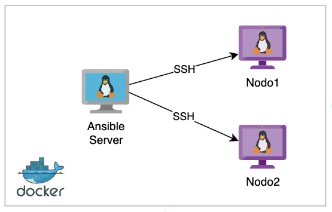

# Entorno de trabajo de Ansible con Nodos en Docker



## clonar repositorio

```
git clone https://github.com/yosoyfunes/ansible-server.git
```

## acceder al repositorio clonado

```
cd ansible-server
```

## Crear Network

Para compartir la red entre Ansible y los contenedores, se debe crear la network `ansible_network`. 
Ejecuta el siguiente comando para crearla si aún no existe:

```
docker network create ansible_network
```

## Iniciar Nodos

```
docker-compose up -d
```

## Generar y Configurar Claves SSH

```
mkdir -p files/.ssh
```

```
ssh-keygen -t rsa -b 2048 -f files/.ssh/id_rsa -N ''
```

## Copiar clave Publica en nodos

```
for server in nodo1 nodo2 nodo3; do
    docker exec -i $server bash -c "mkdir -p /root/.ssh && cat >> /root/.ssh/authorized_keys" < files/.ssh/id_rsa.pub
done
```

## Iniciar server

```
docker run -ti --name ansible-server --network ansible_network -d -v $(pwd)/files:/ansible_work -w /ansible_work yosoyfunes/ansible-server:v1
```

## Acceder al contenedor Ansible Server

```
docker exec -ti ansible-server bash
```

## Correr un comando de Ansible

```
ansible -i inventory.ini all -m ping
```

### Respuesta esperada

```
nodo3 | SUCCESS => {
    "ansible_facts": {
        "discovered_interpreter_python": "/usr/bin/python3"
    },
    "changed": false,
    "ping": "pong"
}
nodo1 | SUCCESS => {
    "ansible_facts": {
        "discovered_interpreter_python": "/usr/bin/python3"
    },
    "changed": false,
    "ping": "pong"
}
nodo2 | SUCCESS => {
    "ansible_facts": {
        "discovered_interpreter_python": "/usr/bin/python3"
    },
    "changed": false,
    "ping": "pong"
}
```